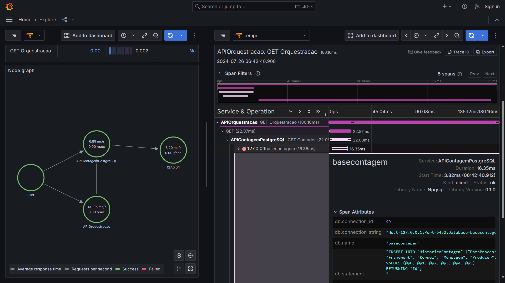

# OpenTelemetry-Grafana-Tempo-DotNet8-APIs-PostgreSQL
Exemplos de uso de OpenTelemetry + Grafana + Tempo com .NET 8, ASP.NET Core, APIs REST e PostgreSQL. Estas aplicações demonstram a implementação de distributed tracing com o Grafana Tempo.

## Criacao do ambiente

Executar o **script Docker Compose** que está em **/scripts/otel**:

```bash
cd ./scripts/otel
docker-compose up -d
```
As aplicações podem ser executadas normalmente via **dotnet run**, a partir do diretório de cada projeto correspondente (**/src/APIContagem** e **/src/APIOrquestracao**).

## Exemplo de trace gerado (visualização a partir do Grafana)


